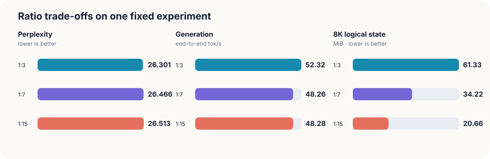
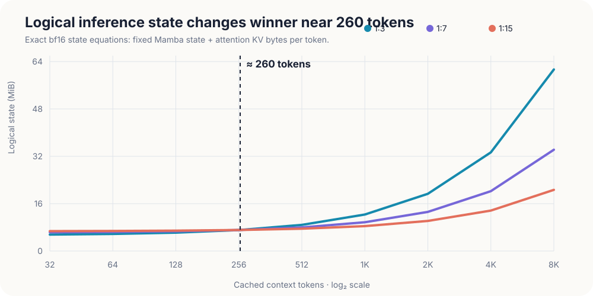

<div align="center">

# Mamba-Transformer Hybrid LM

A 52-54M parameter language-model study that interleaves Mamba-2 selective state-space blocks with causal attention.

[](#week-5-result)
[](#verification)
[](#training-protocol)
[](#training-protocol)

[**Open the experiment showcase**](https://karan-anchan.github.io/mamba-hybrid-lm-showcase/) ·
[Technical reference](https://karan-anchan.github.io/mamba-hybrid-lm-explained/) ·
[Generation API guide](demo/README.md)

</div>

## Research question

> At a fixed token budget and near-matched parameter scale, how does the attention:SSM layer ratio affect validation perplexity, generation speed, and inference-state memory in a small hybrid language model?

I trained three 16-layer variants with attention:SSM ratios of **1:3**, **1:7**, and **1:15**. Every run used the same prepared OpenWebText pool, optimizer schedule, batch geometry, and **700,006,400 sampled token positions**.

The training path uses the portable PyTorch SSD dual form. Week 4 adds the exact recurrent form for inference,
including a bounded-chunk prefill that avoids a full-context Mamba `L x L` matrix. It still does not reproduce
the optimized speed profile of fused Mamba kernels.

## Week 5 result

Week 5 turns the certified checkpoints into a reproducible generation system. A one-model-at-a-time FastAPI
service exposes JSON and token-streaming endpoints, verifies checkpoint identity before loading, reports real
latency and memory, and catches out-of-memory failures without terminating the process. The public showcase is
a separate React site that can use this API when a model host is available. Its GitHub Pages deployment stays in
clearly labelled **recorded evidence mode** otherwise; it never presents stored text as a live model response.

The matched sampled-generation protocol uses three registered prompts, 48 generated tokens, temperature 0.8,
top-k 40, and seeds 1701-1703. Values below are medians across those prompts.

| Ratio | Validation PPL | GPU generation tok/s | TTFT | Peak VRAM | State near 57 tokens | State at 8K |
|:--:|--:|--:|--:|--:|--:|--:|
| **1:3** | **26.301** | **52.32** | **20.3 ms** | **238.5 MiB** | **5.72 MiB** | 61.33 MiB |
| 1:7 | 26.466 | 48.26 | 21.3 ms | 244.6 MiB | 6.41 MiB | 34.22 MiB |
| **1:15** | 26.513 | 48.28 | 23.1 ms | 246.8 MiB | 6.76 MiB | **20.66 MiB** |

The central result is context-dependent. At short contexts, fixed recurrent state makes 1:3 use **15.4% less**
logical state than 1:15. Their calculated curves cross near **260 cached tokens**; beyond that point, attention
KV growth dominates, and 1:15 reaches a **66.3%** state reduction at 8K for a **0.212** perplexity increase.
In this implementation, 1:3 is also 8.4% faster than 1:7 during sampled generation, while 1:7 and 1:15 differ
by only 0.04% in this small protocol.

The matched Ryzen 7700 run reaches **40.44 tok/s**, or 77.3% of the local RTX 5070's 1:3 rate. That supports a
local CPU fallback, not a claim about constrained cloud CPUs. Generated samples also drift, repeat, and invent
facts, so this remains a systems experiment rather than a production assistant.





Authoritative Week 5 artifacts:

- [`results/week5-analysis-v1/`](results/week5-analysis-v1/) - joined findings, machine-readable analysis, vector plots, and hash manifest
- [`results/week5-generation-cuda-v1/`](results/week5-generation-cuda-v1/) - RTX 5070 sampled-generation records
- [`results/week5-generation-cpu-matched-v1/`](results/week5-generation-cpu-matched-v1/) - protocol-matched Ryzen 7700 records
- [`demo/README.md`](demo/README.md) - local and container service instructions
- [Public experiment showcase](https://karan-anchan.github.io/mamba-hybrid-lm-showcase/) - interactive architecture, charts, evidence replay, and optional live API client

## Week 4 result

All three best Week 3 checkpoints were re-evaluated under one batch-1 bf16 inference protocol. The table uses
the longest 8,192-token prompt; decode is the median of three synchronized 32-step greedy runs.

| Ratio | Validation PPL | 8K prefill tok/s | 8K decode tok/s | Attention KV | Mamba state | Total logical state | Needle exact match |
|:--:|--:|--:|--:|--:|--:|--:|--:|
| **1:3** | **26.301** | **14,143** | 46.8 | 56.00 MiB | 5.33 MiB | 61.33 MiB | 3/15 |
| 1:7 | 26.466 | 12,127 | **49.0** | 28.00 MiB | 6.22 MiB | 34.22 MiB | 3/15 |
| **1:15** | 26.513 | 11,876 | 44.6 | **14.00 MiB** | 6.66 MiB | **20.66 MiB** | 3/15 |

The ratio creates a clean memory trade-off. Moving from 1:3 to 1:15 reduces 8K logical state by **66.3%**
while increasing validation perplexity by **0.212**. More Mamba does not make this implementation faster:
1:3 has the strongest prefill rate, and decode stays in a narrow, non-monotonic 44.6–49.0 tok/s band.

Retrieval is the shared weakness. Each ratio retrieves 3 of 15 pre-registered access codes; no model records an
exact match at 2K, 4K, or 8K. An 8K RoPE table and bounded recurrent memory therefore demonstrate execution,
not effective use of that context after training only at length 512.

Authoritative Week 4 artifacts:

- [`results/week4-eval-v1/evaluation_results.json`](results/week4-eval-v1/evaluation_results.json) - every raw timing, memory row, and retrieval answer
- [`results/week4-eval-v1/evaluation_table.md`](results/week4-eval-v1/evaluation_table.md) - compact 8K comparison
- [`results/week4-eval-v1/manifest.json`](results/week4-eval-v1/manifest.json) - clean Git provenance, checkpoint identities, protocol, runtime, and artifact hashes
- [`results/week4-eval-v1/plots/`](results/week4-eval-v1/plots/) - code-native SVG figures

These are single-GPU, single-run measurements with three timing repeats, not confidence intervals. Logical
state is exact tensor storage; active and peak CUDA deltas are reported separately in the JSON.

## Week 3 result

The authoritative matched-token sweep completed on 2026-08-10. Lower perplexity is better.

| Ratio | Attention / Mamba layers | Parameters | Best val PPL | Train tok/s | Peak allocated VRAM |
|:--:|:--:|--:|--:|--:|--:|
| **1:3** | 4 / 12 | 52.53M | **26.30** | **26,808** | **6,684 MB** |
| 1:7 | 2 / 14 | 53.58M | 26.47 | 24,162 | 7,251 MB |
| 1:15 | 1 / 15 | 54.11M | 26.51 | 21,187 | 7,538 MB |

The quality gap is small and favors 1:3 in this single-seed sweep. The 1:15 run was paused at a verified checkpoint when another GPU workload reduced headroom, then resumed with model, optimizer, counters, metrics, and RNG state restored. Its throughput therefore includes external host contention.

The training-efficiency ordering is specific to this implementation. More Mamba layers are slower here because each Mamba block builds a quadratic matrix across fourteen heads. These results do not support a general claim that Mamba is slower or uses more memory than attention.

Authoritative artifacts:

- [`results/week3-700m-v1/sweep_results.json`](results/week3-700m-v1/sweep_results.json) - machine-readable headline metrics and variant signatures
- [`results/week3-700m-v1/sweep_table.md`](results/week3-700m-v1/sweep_table.md) - compact comparison table
- [`results/week3-700m-v1/sweep_manifest.json`](results/week3-700m-v1/sweep_manifest.json) - run settings, data signature, completion state, and exact token exposure
- [`results/week3-700m-v1/README.md`](results/week3-700m-v1/README.md) - interpretation and evidence boundary

The earlier 16.384M-token preview is preserved in [`results/sweep_results.json`](results/sweep_results.json) for the development record, but it is not the headline result.

## What Week 3 establishes

- All three ratio variants train to the same token exposure under one schedule.
- The 1:3 run achieved the lowest validation perplexity in this sweep.
- The best-perplexity spread is only 0.21, so one seed cannot establish statistical separation.
- Run recovery is durable and auditable across checkpoints, append-only metrics, data identity, code identity, and RNG state.
- Training throughput and peak allocated memory describe this PyTorch SSD implementation, not a fused linear-scan Mamba kernel.

Week 4 adds inference throughput, recurrent/KV state scaling, 8K execution, and controlled needle retrieval.
It still does not establish broad generation quality, run-to-run statistical separation, or fused-kernel Mamba
performance.

## Architecture

```text
token IDs
   |
tied embedding
   |
16 x HybridBlock
   |-- RMSNorm -> Mamba-2 SSD or causal attention -> residual
   `-- RMSNorm -> SwiGLU MLP -> residual
   |
RMSNorm -> tied LM head
```

| Component | Locked setting |
|---|---|
| Model width | 448 |
| Layers | 16 |
| Vocabulary | 16,000 byte-level BPE tokens |
| Attention | 7 heads x 64, RoPE, PyTorch SDPA |
| Mamba-2 | inner width 896, 14 heads x 64, state size 128, convolution width 4 |
| MLP | SwiGLU, hidden width 1,216 |
| Context used for training | 512 tokens |
| RoPE table limit | 16,384 positions; evaluated with 8,192-token prompts plus decode |

The ratio is configuration, not a separate implementation. For example, 1:3 repeats:

```python
["mamba", "mamba", "mamba", "attention"]
```

## Data pipeline

The authoritative dataset is a locally prepared, read-only OpenWebText sampling pool:

| Split | Documents | Tokens |
|---|---:|---:|
| Train | 4,113,788 | 5,000,001,094 |
| Validation | 8,353 | 10,001,312 |

Preparation pins the dataset revision, trains the 16k tokenizer separately, writes little-endian `uint16` memmaps, records hashes and source ranges, verifies split continuity, and only then promotes the staging directory. Training revalidates the prepared-data identity before opening a sweep namespace.

The 700M figure is processed token positions sampled with replacement, not 700M unique corpus tokens.

## Training protocol

| Setting | Value |
|---|---:|
| Optimizer | fused AdamW on CUDA |
| Precision | fp32 master weights, bf16 autocast, TF32 matmul |
| Micro-batch | 8 sequences |
| Gradient accumulation | 4 |
| Sequence length | 512 |
| Effective tokens / step | 16,384 |
| Optimizer steps | 42,725 |
| Tokens / variant | 700,006,400 |
| Peak / minimum LR | 1e-3 / 1e-4 |
| Warmup | 855 steps, then cosine decay |
| Gradient clipping | 1.0 |
| Gradient checkpointing | disabled for the sweep |

Validation at each gate averages 50 deterministic batches per split. It samples 204,800 token positions, so it is repeatable but not a complete pass over the validation memmap.

## Quickstart

Python 3.11 is recommended. Install the CUDA-enabled PyTorch build before the rest of the dependencies.

```powershell
uv venv --python 3.11 .venv
.\.venv\Scripts\Activate.ps1
uv pip install --python .venv\Scripts\python.exe torch --index-url https://download.pytorch.org/whl/cu128
uv pip install --python .venv\Scripts\python.exe -r requirements.txt
```

Run the tests:

```powershell
.\.venv\Scripts\python.exe -m pytest tests -q
```

Prepare the small TinyStories debug corpus:

```powershell
.\.venv\Scripts\python.exe -m src.data.train_tokenizer --dataset tinystories --docs 100000 --vocab 16000
.\.venv\Scripts\python.exe -m src.data.prepare_data --dataset tinystories --train-docs 50000 --val-docs 22000
```

Inspect one ratio and train a debug run:

```powershell
.\.venv\Scripts\python.exe scripts\count_params.py --config configs\ratio_1_3.yaml
.\.venv\Scripts\python.exe -m src.train.train --model-config configs\ratio_1_3.yaml --run-id debug-1
```

## Reproducing the authoritative sweep

The full prepared corpus requires at least 9.33 GiB for the two token files before whole-document overshoot, plus space for staging and the Hugging Face cache.

```powershell
# Build the immutable 5B-token sampling pool.
.\.venv\Scripts\python.exe -m src.data.prepare_data `
  --dataset openwebtext `
  --tokenizer data/tokenizer/openwebtext.json `
  --out-dir data/openwebtext-5b `
  --run-id owt-5b-20260809 `
  --revision 79d93d786212f7344586290adb811d4ae6a1762c `
  --train-tokens 5000000000 `
  --val-tokens 10000000

# Verify the exact prepared identity without downloading or tokenizing again.
.\.venv\Scripts\python.exe -m src.data.prepare_data --validate-only data/openwebtext-5b

# Run or resume the three variants.
.\.venv\Scripts\python.exe scripts\run_sweep.py `
  --data-dir data/openwebtext-5b `
  --run-id week3-700m-v1 `
  --max-steps 42725 `
  --warmup-steps 855
```

Reusing a run ID is accepted only when the numerical configuration, data identity, runtime-code fingerprint, and provenance agree. Completed variants are skipped only after their manifests, counters, metrics trajectory, result record, and `best.pt` / `last.pt` checks pass.

## Running the Week 4 evaluation

The inference path keeps one typed state per layer: attention blocks append RoPE-positioned K/V tensors,
while Mamba blocks carry the depthwise-convolution tail and fp32 recurrent SSM state. Long Mamba prefills use
bounded SSD chunks, so an 8K prompt never constructs the training path's full-context `L x L` decay matrix.

Run a short end-to-end check against one real checkpoint:

```powershell
.\.venv\Scripts\python.exe scripts\run_week4_eval.py `
  --smoke `
  --ratio 1:3 `
  --run-id week4-smoke
```

Run or resume the certified three-variant protocol only from a clean implementation commit:

```powershell
.\.venv\Scripts\python.exe scripts\run_week4_eval.py `
  --run-id week4-eval-v1 `
  --require-clean
```

The runner validates every Week 3 checkpoint against its completed manifest and SHA-256 registration before
loading weights. It writes per-variant recovery records under the ignored `outputs/week4-eval/` workspace,
then derives JSON, Markdown, SVG plots, and a signed artifact manifest under `results/<run-id>/`.

## Running the Week 5 generation service

Start the verified 1:3 checkpoint on the local GPU:

```powershell
$env:MAMBA_DEVICE = "cuda"
$env:MAMBA_CORS_ORIGINS = "http://localhost:5173"
.\.venv\Scripts\python.exe -m uvicorn src.serve.app:app --host 127.0.0.1 --port 8000 --workers 1
```

`GET /health` reports the loaded model and device. `POST /v1/generate` returns one measured response, while
`POST /v1/generate/stream` sends token and completion events over Server-Sent Events. Ratio switches unload the
current checkpoint before loading another so three models never occupy the 12 GB GPU together. See the
[generation API guide](demo/README.md) for request fields, limits, CPU mode, and container deployment.

## Repository layout

```text
configs/   ratio-specific model configurations
data/      committed tokenizers; prepared corpora stay local
results/   committed aggregate experiment results
scripts/   parameter analysis and matched-token sweep runner
src/
  data/    tokenizer training, immutable preparation, memmap batching
  model/   attention, Mamba-2 SSD, hybrid blocks, language model
  train/   optimization, checkpointing, recovery, certification
  eval/    Week 4 evaluation and Week 5 analysis modules
  serve/   verified checkpoint registry and FastAPI generation service
tests/     model, data, training, inference, generation, service, and reporting tests
demo/      Week 5 API deployment files and operator guide
```

## Verification

Current repository test result:

```text
55 passed, 1 skipped
```

The skipped test requires CUDA in the test process. The authoritative runs themselves were executed on an RTX 5070 12 GB with CUDA available.

## Roadmap

- [x] Week 1 - environment, tokenizer, data pipeline, parameter budget
- [x] Week 2 - hybrid model, configurable ratios, training loop, TinyStories convergence
- [x] Week 3 - immutable 5B-token pool, recovery hardening, three-model 700M-token sweep
- [x] Week 4 - recurrent inference, throughput, state / KV memory, 8K evaluation, needle retrieval, plots
- [x] Week 5 - FastAPI generation, matched CPU/GPU metrics, analysis plots, public React showcase
- [ ] Week 6 - final documentation and workshop-style report

## References

- Vaswani et al. (2017), [Attention Is All You Need](https://arxiv.org/abs/1706.03762)
- Gu and Dao (2023), [Mamba: Linear-Time Sequence Modeling with Selective State Spaces](https://arxiv.org/abs/2312.00752)
- Dao and Gu (2024), [Transformers are SSMs: Generalized Models and Efficient Algorithms Through Structured State Space Duality](https://arxiv.org/abs/2405.21060)
- Lieber et al. (2024), [Jamba: A Hybrid Transformer-Mamba Language Model](https://arxiv.org/abs/2403.19887)
- Dong et al. (2024), [Hymba: A Hybrid-head Architecture for Small Language Models](https://arxiv.org/abs/2411.13676)

## License

Released under the MIT License. Copyright 2026 Karan Anchan.
